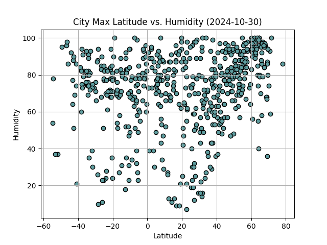

# python-api-challenge

# WeatherPy

## Goals

In this project, my goal was to use Python to visualize the weather of over 500 cities located varying distances from the equator. 

## Methodology

I used Jupyter notebook to access the the citipy Python library and the OpenWeatherMap API.

Building on the starter code, I generated 605 random geographic coordinates and retrieved weather data for the nearest city. 

I then created four scatter plots to show Latitude versus the following weather data: Temperature, Humidity, Cloudiness, and Windspeed. To further explore the relationship between these variables, I created two new DataFrames: northern hemisphere cities and southern hemisphere cities. 

I then defined a function to create the linear regression plots. Xpert Assistance reminded me how to create a function, position the linear equation position, and calculate the r^2 value.

After creating eight scatter plots to show linear regression for each of the four variables in both the northern and southern hempisheres, I provided a discussion of the linear relationship as shown in the plot and by the r^2 value.

## Results and Analysis

The only weather data variables with a very strong correlation was latitude and tempature in the northern hemisphere. Latitude and tempature correlation in the southern hemisphere was moderate. For all other variables compared with latitude (humidity, cloudiness and windspeed), the correlation was very weak (and perhaps none). These results provide evidence that a location's proximity to the equator does indeed have a strong effect on its temperature. 

**Stronger correlation**

**Weaker correlation**

## Challenges

The task that challenged me the most in this activity was just making sure that my api_keys and .gitignore were set up correctly. Initial errors when I was generating the random list of cities momentarily impeded the rest of the project. This project was a good reminder of how to create a function (linear regression being a pretty complex one) that I can repeatedly call as well as how to identify important variables (like the r^2 valueable) within that function to use for additional analysis. I ran into issues with two variables: Wind Speed and Tempature. For Wind Speed, my original variable didn't recognize that there were three values being returned so I had to add further index it for "speed". When my temperature data was being returned in Kelvins, I remembered to add "&units=metric" to my endpoint URL.

# VacationPy

## Goals
In this part of the challenge, I use the Geoapify API and an assortment of Python libraries to create three maps: a map that displays all cities in the city_data_df DataFrame, a map that displays a much smaller group of cities that meet my ideal weather conditions, and a map that display a hotel and country name as additional informaiton in a hover message.

## Methodology
I first made sure to update my API key. After running the starter code to create a city_data_df, I used the hv.plot.points function to create a map of the cities in the data frame. 

Then, I used logical operators to find cities that had a max temp between 22 and 30 degrees C, Wind Speeds between 4 and 24 m/h, and Humidity between 30 and 60. This new DataFrame returned 11 cities that met my ideal vacation weather criteria. I then created a second map to visualize these locations. 

Finally, I created a third DataFrame to store city, country, coordinates, humidity and hotel name for each of the 11 cities. I then modified the starter code and used the Geoapify API in an iteration to find the first hotel located within 10,000 meters of the coordinates for each of the 11 cities. Finally, I created a third map visulazation that added the hotel and country name to the hover message for each city in the map.

## Results and Analysis
The most interesting results of this challenge was narrowing down the city_data to 11 "ideal weather" locations. I found that the majority of cities in that particular set were located around the Atlantic Ocean. The hotel search found hotels for all but three of the cities. Perhaps these are very small or rural locations - more research would be needed to find out why there were no hotels nearby.

**Every city in dataset (marker size determined by humidity)**

**Eleven cities that meet my 'ideal vacation conditions'**

## Challenges
My two primary challenges were configuring the API correctly to return hotel names for the small group of cities and importing the correct modules for map visualization. The first part of the API issue was simply a matter of correctly updating my .gitignore file and putting the api_keys file in the project folder. The second part was a matter of correcting my iteration through the hotel_df DataFrame to iterate through rows for "Lat" and "Lng" values. A BCS Learning Assistant helped me to import the cartopy, geoviews, and pyproj modules that I needed for visualizations.
